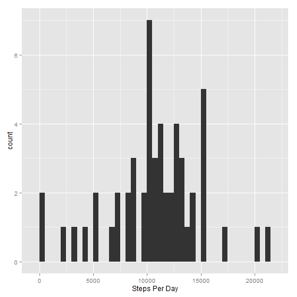
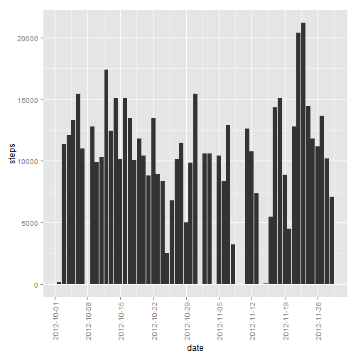
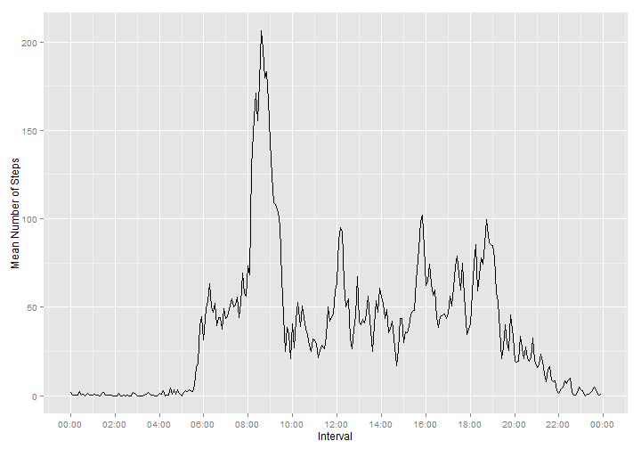
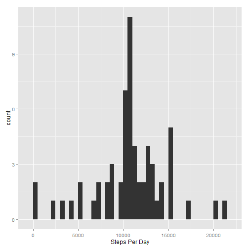
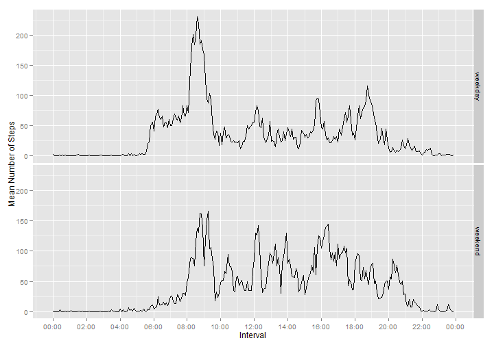

# Reproducible Research: Peer Assessment 1


<br/>
<br/>

## Loading and preprocessing the data


```r
data <- read.csv("activity/activity.csv")

stepsPerDay <- data %>%
               group_by(date = as.Date(date)) %>%
               summarise(steps = sum(steps))
```
<br/>

## What is the mean total number of steps taken per day?
<br/>

#### Part 1
Below is a histogram showing the frequency of occurrence of counts of the total steps taken per day.  This is in accordance with David Cook's (Community TA) [clarification of this part of the assignment](https://class.coursera.org/repdata-010/forum/thread?thread_id=9).


```r
g <- ggplot(stepsPerDay, aes(x = steps)) +
    geom_histogram(binwidth = 500) +
    xlab("Steps Per Day")

print(g)
```

 


#### _Part 1a_
_Below is a bar chart of the total steps taken each day.  This is an additional view, not asked for in the assignment, but supplied here in case graders aren't familiar with Davis Cook's explanation cited above.  This might be construed as answering the question posed in the assignment._


```r
g <- ggplot(stepsPerDay, aes(x = date, y = steps)) +
    geom_bar(stat = "identity") +
    scale_x_date(breaks = date_breaks(width = "1 week")) +
    theme(axis.text.x = element_text(angle = 90, hjust = 1, vjust = 0.5))

print(g)
```

```
## Warning: Removed 8 rows containing missing values (position_stack).
```

 
<br/>

#### Part 2a
Below is calculated the mean total number of steps taken per day.


```r
meanStepsPerDay <- mean(stepsPerDay$steps, na.rm = TRUE)
print(meanStepsPerDay)
```

```
## [1] 10766.19
```
<br/>

#### Part 2b
Below is calculated the median total number of steps taken per day.

```r
medianStepsPerDay <- median(stepsPerDay$steps, na.rm = TRUE)
print(medianStepsPerDay)
```

```
## [1] 10765
```
<br/>
<br/>

## What is the average daily activity pattern?
<br/>

#### Part 1
Below is a time series plot of the 5-minute interval (x-axis) and the average number of steps taken, averaged across all days (y-axis).


```r
data$interval <- as.POSIXct(paste(data$interval %/% 100, data$interval %% 100), format = "%H %M")

meanStepsPerInterval <- data %>%
    group_by(interval) %>%
    summarise(intervalMean = mean(steps, na.rm = TRUE))

g <- ggplot(meanStepsPerInterval, aes(interval, intervalMean)) +
    geom_line() +
    scale_x_datetime(labels = date_format("%H:%M"), breaks = "2 hour") +
    ylab("Mean Number of Steps") +
    xlab("Interval")
    

print(g)
```

 
<br/>

#### Part 2
Below is calculated the 5-minute interval which, on average across all the days in the dataset, contains the maximum number of steps.


```r
maxInterval <- meanStepsPerInterval %>%
    filter(intervalMean == max(intervalMean))

print(format(maxInterval$interval, "%H:%M"))
```

```
## [1] "08:35"
```
<br/>
<br/>

## Imputing missing values
<br/>

#### Part 1
Below is calculated the total number of rows with NA values.


```r
nrow(filter(data, is.na(steps)))
```

```
## [1] 2304
```

<br/>

#### Part 2
These values will be replaced with the mean for the given interval across all days.
<br/>

#### Part 3
A new data set is created with the missing values filled in.

```r
data2 <- data %>%
    group_by(interval) %>%
    mutate(steps = ifelse(is.na(steps), mean(steps, na.rm = TRUE), steps))
```

The first few rows of the original data set and the new data set are shown to verify that the NA's have been replaced, and the number of rows with NA's is recalculated on the new data set to verify they have all been replaced.

_Note, the interval column shows yyyy-mm-dd hh:mm:ss since it was changed to a POSIXct type for proper plotting above.  The date shown in the interval is the run date of the program.  It can be ignored.  Only the hour and minute are significant._

```r
head(data)
```

```
##   steps       date            interval
## 1    NA 2012-10-01 2015-01-14 00:00:00
## 2    NA 2012-10-01 2015-01-14 00:05:00
## 3    NA 2012-10-01 2015-01-14 00:10:00
## 4    NA 2012-10-01 2015-01-14 00:15:00
## 5    NA 2012-10-01 2015-01-14 00:20:00
## 6    NA 2012-10-01 2015-01-14 00:25:00
```

```r
head(data2)
```

```
## Source: local data frame [6 x 3]
## Groups: interval
## 
##       steps       date            interval
## 1 1.7169811 2012-10-01 2015-01-14 00:00:00
## 2 0.3396226 2012-10-01 2015-01-14 00:05:00
## 3 0.1320755 2012-10-01 2015-01-14 00:10:00
## 4 0.1509434 2012-10-01 2015-01-14 00:15:00
## 5 0.0754717 2012-10-01 2015-01-14 00:20:00
## 6 2.0943396 2012-10-01 2015-01-14 00:25:00
```

```r
nrow(filter(data2, is.na(steps)))
```

```
## [1] 0
```
<br/>

#### Part 4a
Below is a histogram of the total number of steps taken each day with the NA's replaced.


```r
stepsPerDay2 <- data2 %>%
               group_by(date = as.Date(date)) %>%
               summarise(steps = sum(steps))

g <- ggplot(stepsPerDay2, aes(x = steps)) +
    geom_histogram(binwidth = 500) +
    xlab("Steps Per Day")

print(g)
```

 
<br/>

#### Part 4b
Below is calculated the mean total number of steps taken per day with the NA's replaced.


```r
meanStepsPerDay2 <- mean(stepsPerDay2$steps)
print(meanStepsPerDay2)
```

```
## [1] 10766.19
```
<br/>

#### Part 4c
Below is calculated the median total number of steps taken per day with the NA's replaced.

```r
medianStepsPerDay2 <- median(stepsPerDay2$steps)
print(medianStepsPerDay2)
```

```
## [1] 10766.19
```
<br/>

#### Part 4d
The new values for the mean and median numnber of steps taken each day are roughly the same as the data set with NA's.  Since there were only 8 of the 61 days that had NA's, the impact of imputing them with the mean for each interval was not hugely significant.
<br/>
<br/>

## Are there differences in activity patterns between weekdays and weekends?
<br/>

#### Part 1
Below, a new factor variable is created with two levels -- "weekday" and "weekend" indicating whether a given date is a weekday or weekend day.


```r
data2 <- data2 %>%
    mutate(weekend = ifelse(as.POSIXlt(date)$wday %in% c(0, 6), "weekend", "weekday"))
```
<br/>

### Part 2
Below is a panel plot containing a time series plot of the 5-minute interval (x-axis) and the average number of steps taken, averaged across all weekday days or weekend days (y-axis).
<br/>


```r
meanStepsPerInterval2 <- data2 %>%
    group_by(interval, weekend) %>%
    summarise(intervalMean = mean(steps))

g <- ggplot(meanStepsPerInterval2, aes(interval, intervalMean)) +
    geom_line() +
    scale_x_datetime(labels = date_format("%H:%M"), breaks = "2 hour") +
    facet_grid(weekend ~ .) +
    ylab("Mean Number of Steps") +
    xlab("Interval")

print(g)
```

 

